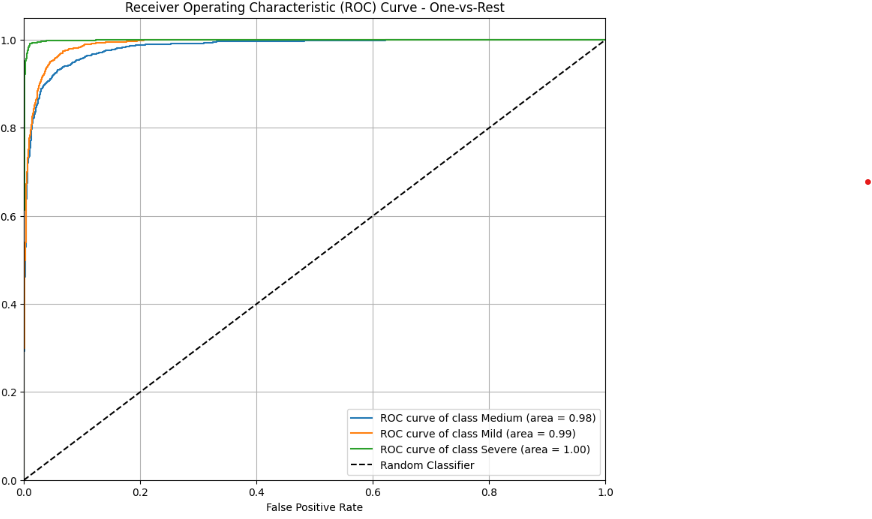
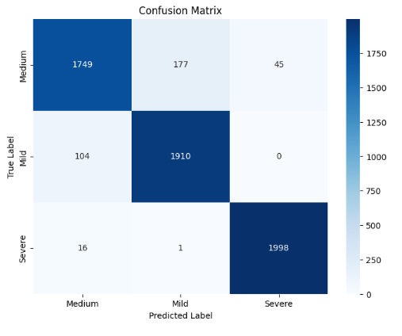

# 🧠 High-Accuracy Automated Acne Severity Grading

A Deep Learning Approach using EfficientNet-B0 and Large-Scale Data Augmentation

## Overview

This project presents a high-accuracy deep learning pipeline for automated acne severity grading using EfficientNet-B0, a custom preprocessing stage, and an extensive augmentation strategy.  
The model classifies images into three severity levels:

- Mild
- Medium
- Severe

Starting with a limited dataset of 999 images, the dataset was expanded to ~30,000 balanced samples, enabling the model to achieve 94.01% validation accuracy.  
A Gradio web interface is included for real-time inference.

---

## Project Structure

```
├── data/
│   ├── original_dataset/
│   ├── augmented_dataset/
│   └── testers/
├── src/
│   ├── preprocessing.py
│   ├── augmentation.py
│   ├── train.py
│   ├── evaluate.py
│   └── app.py (Gradio deployment)
├── model.keras
├── requirements.txt
└── README.md
```

---

## Dataset Summary

## Data Preview


### Original Dataset
| Class  | Samples |
|--------|---------|
| Mild   | 387     |
| Medium | 473     |
| Severe | 139     |

### After Augmentation
| Class  | Target  | Final Count |
|--------|---------|-------------|
| Mild   | 10,000  | 10,000      |
| Medium | 10,000  | 10,000      |
| Severe | 10,000  | 10,000      |

Total dataset size: **30,000 images**

---

## Preprocessing

Custom Artifact Removal: `remove_black()`

The dataset contained inconsistencies such as:

- Black borders
- Background noise
- Cropping artifacts

The preprocessing function:
- Converts to grayscale
- Creates a non-black pixel mask
- Calculates bounding box
- Crops to ROI
- Replaces leftover dark pixels with white

This ensures the model focuses only on facial regions and acne features.


---

## Data Augmentation

The augmentation pipeline (Keras API) includes:

- Random flip
- Random rotation (≤ 20%)
- Random zoom (≤ 20%)
- Random brightness
- Random contrast
- Random translation

Used to expand the dataset 20× and reduce overfitting.

---

## Model Architecture

- Backbone: EfficientNet-B0 (pre-trained on ImageNet)
- Classification head:
  - GlobalAveragePooling2D
  - Dropout
  - Dense(128)
  - Dropout
  - Dense(3)  # Mild, Medium, Severe

Total Parameters: ~4.2M  
Optimizer: Adam  
Loss: SparseCategoricalCrossentropy  
Epochs: 46 (early stopping applied)

---

## Performance

### Validation Results
- Accuracy: **94.01%**
- Loss: **0.14**

### Classification Report
| Class  | Precision | Recall | F1 Score |
|--------|-----------|--------|----------|
| Mild   | 0.91      | 0.95   | 0.93     |
| Medium | 0.94      | 0.89   | 0.91     |
| Severe | 0.98      | 0.99   | 0.98     |
| Overall| 0.94      | 0.94   | 0.94     |





---

## Deployment (Gradio App)

A Gradio interface is included with:
- Image upload
- Automatic preprocessing
- Severity prediction (with confidence score)

Usage example:

```bash
python src/app.py
```

Then open the local URL generated by Gradio.

---

## Real-World Testing

External images (outside dataset) were used to verify:
- Model stability
- Robustness of preprocessing
- Consistency of severity classification

---

## Future Improvements

- Add Grad-CAM or SHAP for explainability
- Integrate lesion counting for GAGS score mapping
- Improve performance on diverse skin tones
- Collect a fully external validation dataset for medical evaluation

---

## Requirements

See `requirements.txt` for exact package versions used.

---

## License
